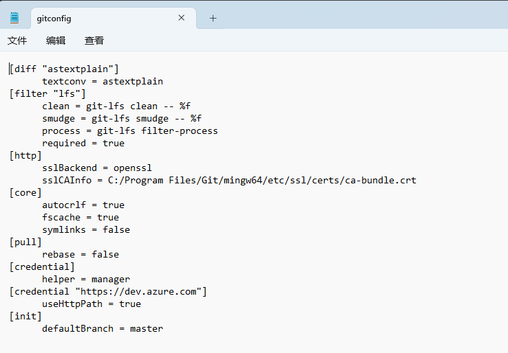

# Git理论


使用`git add "files"`暂存文件（Stage(Index)），使用`git commit`提交到本地仓库（History），使用`git push` 提交在远程仓库

- Workspace：工作区，就是你平时存放项目代码的地方
- Index / Stage：暂存区，用于临时存放你的改动，事实上它只是一个文件，保存即将提交到文件列表信息
- Repository：仓库区（或本地仓库），就是安全存放数据的位置，这里面有你提交到所有版本的数据。其中HEAD指向最新放入仓库的版本
- Remote：远程仓库，托管代码的服务器，可以简单的认为是你项目组中的一台电脑用于远程数据交换


## 工作流程

git的工作流程一般是这样的：

１、在工作目录中添加、修改文件；

２、将需要进行版本管理的文件放入暂存区域；

３、将暂存区域的文件提交到git仓库。

因此，git管理的文件有三种状态：已修改（modified）,已暂存（staged）,已提交(committed)


# Git的使用记录

## 0、安装git

### windows

安装git后有Git Bash、Git CMD、Git GUI

Git Bash：Linux风格命令行，使用最多

Git CMD：windows风格的命令行

Git GUI：图形界面Git，不建议初学者使用，先熟悉常用命令


## 1、本地仓库搭建

查看git全部配置： 
```bash
git config -l
```


查看git系统配置（不含用户配置，显示系统配置）

```bash
git config --system --list
```

查看git本地配置（不含系统配置，显示用户姓名和邮箱）
```bash
git config --global --list
```

配置git
```bash
git init   // 在当前目录初始化，创建一个.git隐藏文件夹，文件夹内保存每个git版本记录和变化
git config --global user.name "Yihan"
git config --global user.email "1286711270@qq.com"
```

所有的配置文件保存在本地：Git/etc/gitconfig



master：主分支（保存在HEAD文件中，一般在自己的分支中进行自己的代码操作）


C:\file2disk\markdown\git_learn\picture

初始化后文件还没有被记录实用git add将文件加入git版本控制系统中

## 2、暂存文件

```bash
git add [fliename]
git add.    # 可使用git add.添加当前目录所有文件
```

添加后，git只是暂时保存，还不会保存提交记录

### 忽略文件

有些时候我们不想把某些文件纳入版本控制中，比如数据库文件，临时文件，设计文件等

在主目录下建立".gitignore"文件，此文件有如下规则：

1. 忽略文件中的空行或以井号（#）开始的行将会被忽略。

2. 可以使用Linux通配符

   例如：星号（*）代表任意多个字符

   ​			问号（？）代表一个字符

   ​			方括号（[abc]）代表可选字符范围

   ​			大括号（{string1,string2,...}）代表可选的字符串等。

3. 如果名称的最前面有一个感叹号（!），表示例外规则，将不被忽略。

4. 如果名称的最前面是一个路径分隔符（/），表示要忽略的文件在此目录下，而子目录中的文件不忽略。

5. 如果名称的最后面是一个路径分隔符（/），表示要忽略的是此目录下该名称的子目录，而非文件（默认文件或目录都忽略）。

```bash
#为注释
*.txt        #忽略所有 .txt结尾的文件,这样的话上传就不会被选中！
!lib.txt     #但lib.txt除外
/temp        #仅忽略项目根目录下的TODO文件,不包括其它目录temp
build/   	 #忽略build/目录下的所有文件
doc/*.txt    #会忽略 doc/notes.txt 但不包括 doc/server/arch.txt
```

## 3、提交文件

```bash
git commit  # 将刚暂时保存的变更提交，固定成一个版本，自动进入vim编辑器，写提交说明
git log  # 查看提交信息
git commit -m "第二次提交"  # 写提交说明的简化版操作，跳过vim编辑
git commit -m "fix(test): change content"  # 提交风格规范
```


vscode 自带提示：新增文件显示绿色，修改文件显示橙色

## 4、查看文件状态

```bash
git status [filename]	# 查看单个文件状态
git status			   # 查看所有文件状态
```

版本控制就是对文件的版本控制，要对文件进行修改、提交等操作，首先要知道文件当前在什么状态，不然可能会提交了现在还不想提交的文件，或者要提交的文件没提交上。

- `Untracked`: 未跟踪, 此文件在文件夹中, 但并没有加入到git库, 不参与版本控制. 通过`git add` 状态变为`Staged`.

- `Staged`: 暂存状态. 执行`git commit`则将修改同步到库中, 这时库中的文件和本地文件又变为一致, 文件为`Unmodify`状态.

  执行`git reset HEAD filename`取消暂存, 文件状态为`Modified`

- `Unmodify`: 文件已经入库, `git add` 之后还未修改,

  如果它被修改, 而变为`Modified`

  使用`git rm`移出版本库, 则成为`Untracked`文件

- `Modified`: 文件已修改, 仅仅是修改, 并没有进行其他的操作. 

  使用`git add`可进入暂存staged状态, 

  使用`git checkout`则丢弃修改过, 返回到`unmodify`状态, 这个`git checkout`即从库中取出文件, 覆盖当前修改 

## 5、提交到远程仓库

### 配置ssh公钥

进入`用户`文件夹中建立`.ssh`文件夹，在Git Bash中打开后使用

```bash
ssh-keygen -t rsa	# 其中-t rsa为加密算法,也可以使用其他加密算法，此处建议使用rsa
```

生成公钥


带有.pub的文件为公共的

打开复制到github中添加ssh密钥

### 管理仓库

在github上新建一个仓库后

其中

```bash
git branch -M main  # 本地创建一个main分支，并将主分支切换到main
git remote add origin https://github.com/YihanWn/yihan_git_learn.git  # 添加一个仓库地址链接(remote origin),上传的地址,此处为https地址而不是ssh
git push -u origin main  # 推送上传到仓库
```

remote origin使用https地址，则设置ssh后仍然需要输入密码

因为用的是`https`而不是`ssh`，更新`origin`为`ssh`格式
`HTTPS`的格式为：`https://github.com/用户名/仓库名.git`
`SSH`的格式为：`git@github.com:用户名/仓库名.git`

```bash
git remote remove origin
git remote add origin git@github.com:用户名/仓库名.git
```

再`push`的时候实际上是采用的`SSH`方式推送的代码。（打开`config`文件可以看到`[remote "origin"]`的`url`为`ssh`格式）

**remote origin 只能有一个**

通过

```bash
git remote rm origin	# 移除remote origin
```

移除`remote origin`

提交后，文件提交到当前仓库的该分支下


### 其他操作

```bash
git remote -v  # 查看仓库链接
git remote add upstream https://github.com/peng-zhihui/HoloCubic.git  # 添加上游代码库
# 再次使用git remote -v 课查看到upstream的仓库链接
# 给别人加功能，可以先创建一个分支 git checkout -b wyh
git checkout -b wyh
```

## 6、标准流程：

```bash
git add .
git commit -m “add(member):wyh”
git push -u origin wyh  # (git push --set-upstream origin wyh)  第一次push需要加后面的参数指明push源和分支
```

//注意push时，翻墙会报错 fatal:unable to access ‘https://github.com/.../.git‘:Could not resolve host:github.com

​	

# 分支管理

```bash
# 查看本地所有分支
git branch		   
git branch -a   	

git branch -r 			    # 查看远程分支

git branch [branch]		    # 创建一个分支，但依旧停留在该分支
git checkout -b [branch]   	# 新建一个分支，并切换到该分支

git brand -d [branch]		# 删除一个分支

# 删除远程分支
git push origin --delete [branch]	
git branch -dr	[remote/branch]

git merge [bran]			# 合并分支
```

// 可以看到有两个branch

进入Pull requests(Pr) 见New pull request

通过选择base与compare分支

显示绿色对号 Able to merge 可以合并

可点击 Create pull request ，填写pr信息，创建pr(create pull request)

如果不能merge(合并)，可能是有人提交了新的commit，导致版本不一致，需要执行 git fetch upstream 从上游更新最新代码

```bash
git fetch upstream
git merge upstream/main  # 把远程的最新代码合并到自己的分支中
git push  # 推送上去
```

